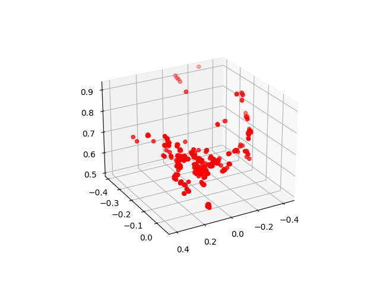
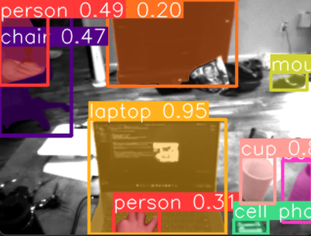
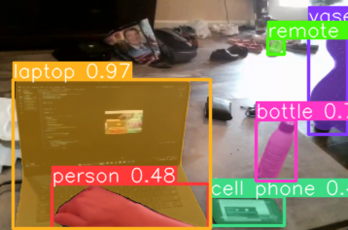

# SLAM-Detection

Code to test the basics of SLAM and CV object detection

## Change log:

7-24-2023

- Added map creation ability to triangulate with two images
- 

7-17-2023

- Below are future plans
- Steps for SLAM: https://www.mathworks.com/help/vision/ug/monocular-visual-simultaneous-localization-and-mapping.html
    - Download Input Image Sequence
    - Map Initialization
    - Store Initial Key Frames and Map Points
    - Initialize Place Recognition Database (https://ai.stackexchange.com/questions/21914/what-are-bag-of-features-in-computer-vision)
    - Refine and Visualize Initial Reconstruction
    - Tracking
    - Local Mapping
    - Loop Closure
    - Compare to Ground Truth
 
- Additional Features to Add to SLAM
    - Implement EKF SLAM to introduce data from odometry: https://www.iri.upc.edu/people/jsola/JoanSola/objectes/curs_SLAM/SLAM2D/SLAM%20course.pdf
    - Adding Appearance Based Mapping: https://shivachandrachary.medium.com/introduction-to-3d-slam-with-rtab-map-8df39da2d293
    - Semi-Dense SLAM Mapping (using semantic segmentation, maybe label colors of points with the type of object it is): https://imaginghub.com/blog/17-simultaneous-localization-mapping-a-visual-slam-tutorial
    - Deep Fusion (Dense 3D reconstruction): https://arxiv.org/pdf/2207.12244.pdf
    - ROS SLAM? : https://wiki.ros.org/image_geometry
 
- Segmentation Training
    - Introduction to Image Segmentation: https://huggingface.co/tasks/image-segmentation
    - COCO Database (Image Database): https://cocodataset.org/#download
    - Descriptions on how to test quality: https://iq.opengenus.org/pq-sq-rq/
    - Creating custom semantic model: https://towardsdatascience.com/building-a-custom-semantic-segmentation-model-abb0843ac12d
    - Tensor Flow Image Segmentation: https://www.tensorflow.org/tutorials/images/segmentation

- LIDAR Research
    - Unrelated potential ROS/LIDAR Project: https://automaticaddison.com/how-to-build-an-indoor-map-using-ros-and-lidar-based-slam/
    - https://www.amazon.com/Slamtec-RPLIDAR-Scanning-Avoidance-Navigation/dp/B07TJW5SXF/ref=asc_df_B07TJW5SXF/?tag=hyprod-20&linkCode=df0&hvadid=385584089652&hvpos=&hvnetw=g&hvrand=12106434859228457822&hvpone=&hvptwo=&hvqmt=&hvdev=c&hvdvcmdl=&hvlocint=&hvlocphy=9028280&hvtargid=pla-833793200531&psc=1&tag=&ref=&adgrpid=76780761017&hvpone=&hvptwo=&hvadid=385584089652&hvpos=&hvnetw=g&hvrand=12106434859228457822&hvqmt=&hvdev=c&hvdvcmdl=&hvlocint=&hvlocphy=9028280&hvtargid=pla-833793200531
    - LIDAR Usage: https://towardsdatascience.com/indoor-robot-localization-with-slam-f8b447bcb865
    

  

7-16-2023

    
- Haven't updated the README in a couple days
- Fixed threading issues
- Also added Yolo segmentation in YOLO.py
- Renamed test-takeoff.py to test_takeoff.py due to issues calling it with the dash
- created main.py as the main file for running all drone code

- Useful sources:
    - YOLO Predict Usage: https://docs.ultralytics.com/modes/predict/
    - YOLO Python Usage: https://docs.ultralytics.com/usage/python/
    - Youtube Tutorial: https://www.youtube.com/watch?v=IHbJcOex6dk&ab_channel=NicolaiNielsen
    - Segment Models: https://docs.ultralytics.com/tasks/segment/
    - Collab Showing Training: https://colab.research.google.com/github/ultralytics/ultralytics/blob/main/examples/tutorial.ipynb#scrollTo=7ZW58jUzK66B

7-10-2023

    
- Downgraded OpenCv to 4.5.2.52 to fix "raise TelloException('Failed to grab video frames from video stream')"
- Made thread a daemon thread to be killed when program exits
- created retrieve_images.py to get images from both the laptop camera and drone camera

7-9-2023 - Second Push

- Updated DJI Tello Firmware to latest version (2.05.01.19) on app to get down view capabilities 
- Added down viewing capabilities

7-9-2023

    
- Make sure to turn on Airplane mode before flying
- Recieved Error: "djitellopy.tello.TelloException: Command 'left 100' was unsuccessful for 4 tries. Latest response:      'error No valid imu'"
    - Solved by holding down power button for 5 seconds and resetting wifi
- Implementing Camera Feed
    - Used inspiration from: https://github.com/damiafuentes/DJITelloPy/blob/master/examples/record-video.py
- Issues with Camera Feed being Blue
    - Solved with "im_rgb = cv2.cvtColor(img, cv2.COLOR_BGR2RGB)"

